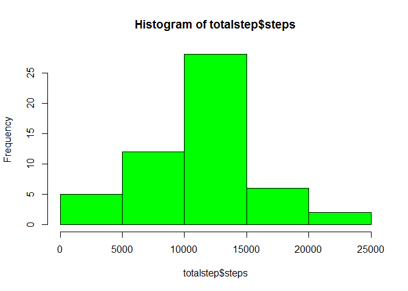
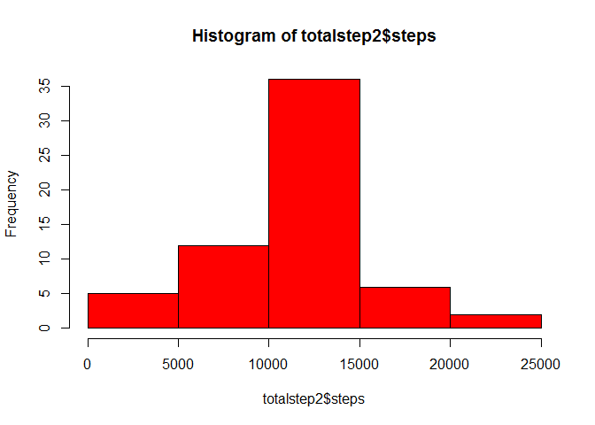

RepData peer Assesssment 1

Loading and preprocessing the data

    data<-read.csv('activity.csv')

What is mean total number of steps taken per day?

    #get the total step by the each day
    totalstep<-aggregate(steps~date,data,sum)
    #plot the  histogram 
    hist(totalstep$steps,col='green')

  

    #get the mean and median
    stepmean<-mean(totalstep$steps,na.rm=T)
    stepmedian<-median(totalstep$steps,na.rm=T)

What is the average daily activity pattern?

    #get the aver step by the interval
    averstepIn<-aggregate(steps~interval,data,mean)
    #make the series plot
    plot(steps~interval,data=averstepIn,type="l")

  

    #get the maximum of the steps
    maxstep<-max(averstepIn$steps)
    maxInteval<-averstepIn[averstepIn$steps==maxstep,]$interval

Imputing missing values

    #calculate the null 
    counts<-sum(is.na(data$steps))
    #fill the null with mean of the intervals
    filleddata<-data
    for (i in 1:nrow(data)){
      if(is.na(data[i,]$steps)){
        filleddata[i,]$steps<-averstepIn[averstepIn$interval==data[i,]$interval,]$steps
      }
    }

    #get the total step by the each day for the filled data

    totalstep2<-aggregate(steps~date,filleddata,sum)
    #plot the hist
    hist(totalstep2$steps,col='red') 

  

    #get the mean and median
    mean(totalstep2$steps) 

    ## [1] 10766.19

    median(totalstep2$steps)

    ## [1] 10766.19

Are there differences in activity patterns between weekdays and
weekends?

    #set the local time to UTC
    Sys.setlocale('LC_TIME', "C")

    ## [1] "C"

    #get a new column to the weekdays
    filleddata$week<-weekdays(as.POSIXct(filleddata$date))
    filleddata$weekend<-ifelse(filleddata$week=='Saturday'|filleddata$week=='Sunday','weekend','weekday')
    filleddata$weekend=factor(filleddata$weekend,levels=c("weekday","weekend"))
    averstepsIn2=aggregate(steps~interval+weekend,filleddata,mean)
    library(lattice)
    xyplot(steps~interval|factor(weekend),data=averstepsIn2,layout=c(1,2),type="l")

